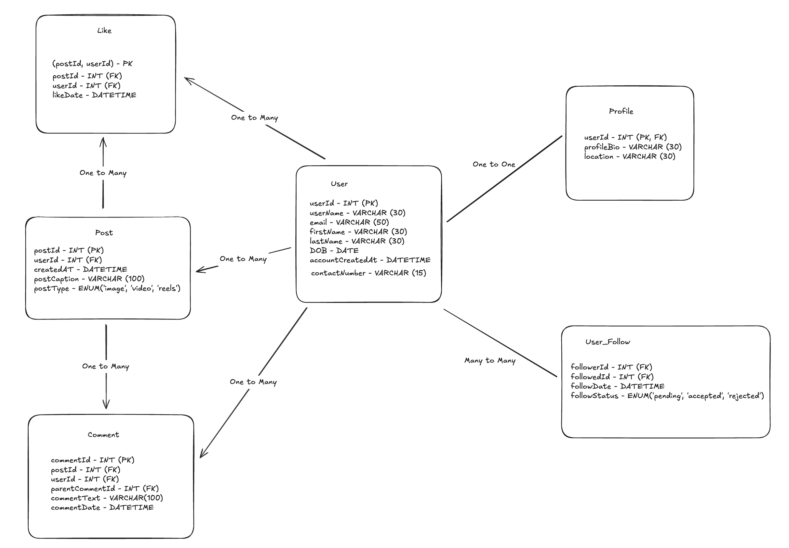

# Design Instagram

## Objective: Discuss and design schema for Instagram.

## Requirement Analysis:
1. Analyse various entities.
2. Identify relationships between entities.
3. Define attributes for each entity.
4. Discuss keys and constraints for each entity.
5. Create a schema diagram.
6. Tackle two important areas:
  - User Management (User, Profile)
  - Post Management (Post, Comment, Like)


## Step 1: Identifying Entities

1. User
  - Represents a user of the Instagram application.
2. Post
  - Represents a post made by a user.
  - Assumption: A post can be of any type (image, video, etc.).
3. Like
  - Represents a like made by a user on a post.
4. Comment
  - Represents a comment made on a post by a user.
5. Profile
  - Represents the profile information of a user.

## Step 2: Writing attributes for each entity

1. User
```sql
  - userId (INT) (Primary Key)
  - userName (VARCHAR) (NOT NULL, UNIQUE)
  - email (VARCHAR) (NOT NULL, UNIQUE)
  - firstName (VARCHAR)
  - lastName (VARCHAR)
  - DOB (DATE)
  - accountCreatedAt (DATETIME) (DEFAULT CURRENT_TIMESTAMP)
  - contactNumber (VARCHAR) (NULLABLE)
```

- Things to discuss:
  - `UNIQUE` constraint on userName and email.
  - Age can be a derived attribute from DOB.
  - Discussing datatypes such has VARCHAR, INT, DATE, DATETIME.
  - Add indexing on userName and email for faster lookups.

2. Post
```sql
  - postId (INT) (Primary Key)
  - userId (INT) (Foreign Key referencing User) (NOT NULL)
  - createdAt (DATETIME) (DEFAULT CURRENT_TIMESTAMP)
  - postCaption (VARCHAR) (NULLABLE)
  - tags (VARCHAR)
  - postType (ENUM: 'image', 'video', 'reels') (NOT NULL)
```

- Things to discuss:
  - tags is a multivalued attribute, can be stored as a separate table.
  - postCaption can be NULL if the post is an image without a caption.
  - Choosing userId as a foreign key to link posts to users. This enforces that a post must belong to a user and hence maintains `referential integrity`.
  - Index (userId, createdAt) for feed rendering.

3. Like
```sql
  - postId (INT) (Foreign Key referencing Post)
  - userId (INT) (Foreign Key referencing User)
  - likeDate (DATETIME)
```

- Things to discuss:
  - Choosing postId and userId as foreign keys to link likes to posts and users respectively.
  - Primary Key: (postId, userId). Don't need a separate primary key for Like entity like likeId, as the combination of postId and userId is unique.

4. Comment
```sql
  - commentId (INT) (Primary Key)
  - postId (INT) (Foreign Key referencing Post) (NOT NULL)
  - userId (INT) (Foreign Key referencing User) (NOT NULL)
  - parentCommentId (INT) (Foreign Key referencing Comment - Used for nested comments) (NULLABLE)
  - commentText (VARCHAR) (NULLABLE)
  - commentDate (DATETIME) (DEFAULT CURRENT_TIMESTAMP)
```

- Things to discuss:
  - parentCommentId allows for nested comments. Can be used to handle `replies` to a particular comment.
  - commentText can be NULL if the comment is a reaction (like an emoji).
  - Choosing postId and userId as foreign keys to link comments to posts and users respectively. This enforces that a comment must belong to a post and a user, maintaining referential integrity.

5. Profile
```sql
  - userId (INT) (Primary Key, Foreign Key referencing User)
  - profileBio (VARCHAR)
  - location (VARCHAR)
  - followersCount (INT) (Discuss why we should not store this)
  - followingCount (INT) (Discuss why we should not store this)
  - postCount (INT) (Discuss why we should not store this)
```

- Things to discuss:
  - userId as a foreign key to link profile to user. This enforces that a profile must belong to a user. Since, this is unique to a user, it can also be a primary key.
  - profileBio can be NULL if the user has not set a bio.
  - followersCount, followingCount, and postCount can be derived attributes based on the relationships with User, Post, and Like entities.
  - Imagine a scenario where a user has lot of followers, following, and posts. Storing these counts in the Profile table can lead to data inconsistency if not updated correctly. Instead, we can derive these counts when needed by querying the User_Follow and Post tables.

6. User_Follow
```sql
  - followerId (INT) (Foreign Key referencing User)
  - followedId (INT) (Foreign Key referencing User)
  - followDate (DATETIME) (DEFAULT CURRENT_TIMESTAMP)
  - followStatus (ENUM: 'pending', 'accepted', 'rejected')
```

- Things to discuss:
  - This table represents the many-to-many relationship between users.
  - followerId and followedId can be used to identify who is following whom.
  - Primary Key: (followerId, followedId) to ensure that a user cannot follow the same user multiple times.
  - Only status = 'accepted' should count towards followersCount.
  - `If a profile is public`, automatically insert with 'accepted' status.
  - `If a profile is private`, insert with 'pending', and let user approve.
  - This is different from follow, following in Twitter-like application, where a user can follow another user without the latter's approval. Here, for Instagram enforcing that a user must approve the follow request.


## Step 3: Identifying Relationships among entities

### User relationships:
1. User to Post
  - A user can have multiple posts, but a post belongs to one user.
  - Relationship: One-to-Many

2. User to Like
  - A user can like multiple posts, but a like belongs to one user.
  - Relationship: One-to-Many

3. User to Comment
  - A user can comment on multiple posts, but a comment belongs to one user.
  - Relationship: One-to-Many
  - A user can also reply to multiple comments, but a comment belongs to one user.
  - Relationship: One-to-Many

4. User to Profile
  - A user has one profile, and a profile belongs to one user.
  - Relationship: One-to-One

5. User to User 
  - A user can follow multiple users, and a user can be followed by multiple users.
  - Relationship: Many-to-Many
  - This relationship can be represented using a separate table `User_Follow` with attributes:
    - followerId (INT) (Foreign Key referencing User)
    - followedId (INT) (Foreign Key referencing User)


### Post relationships:
1. Post to Like
  - A post can have multiple likes, but a like belongs to one post.
  - Relationship: One-to-Many

2. Post to Comment
  - A post can have multiple comments, but a comment belongs to one post.
  - Relationship: One-to-Many

3. Post to Tag
  - A post can have multiple tags, and a tag can belong to multiple posts.
  - Relationship: Many-to-Many
  - This relationship can be represented using a separate table `Post_Tag` with attributes:
    - postId (INT) (Foreign Key referencing Post)
    - tag (VARCHAR)


## Step 4: Schema Diagram


Shareable Link: [View and edit on Excalidraw](https://excalidraw.com/#json=yfsKUAUZ4mgFKJxDavgQP,mKF16P7UtTpyhgXLOqIfAQ)